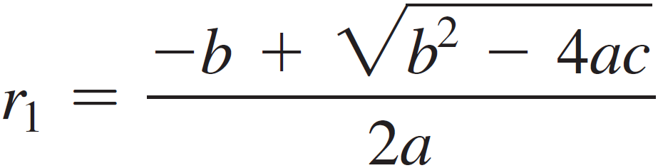
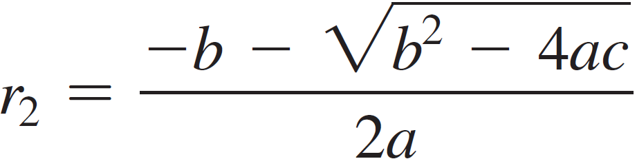

# Problem 1

Solving Quadratic Equations. The two roots of a quadratic equation ax2 + bx + c = 0 can be obtained using the following formulas:




b2 - 4ac is called the discriminant of the quadratic equation. If it is a positive value, the equation has two real roots. If the value is zero, the equation has one root. If the value is negative, the equation has no real roots.

Write a program that prompts the user to enter the values for a, b, and c. Then displays the results based on the discriminant.

## Output Example
```
Enter a, b, c: 1.0 3 1
The equation has two roots -0.381966 and -2.61803

Enter a, b, c: 1 2.0 1
The equation has one root -1.0

Enter a, b, c: 1 2 3
The equation has no real roots
```
Make sure the values generated in the code/program are correct. The output does not have to match the example 100%.

# Problem 2

Multiply Four Numbers. The program in Listing 3.1, AdditionQuiz.java, generates two integers and prompts the user to enter the product of these two integers. Revise the program to generate four single-digit integers and prompt the user to enter the multiplication of these four integers

# Problem 3

Random Month. Write a program that randomly generates an integer between 1 and 12. Then, display this random number. Then, display the English month names January, February, all the way up to December for the numbers 1 through 12, accordingly.

## Output Example
```
#3
March

#6
June
```
Make sure the values generated in the code/program are correct. The output does not have to match the example 100%.

# Problem 4

Check ISBN-10. An ISBN-10 (International Standard Book Number) consists of 10 digits: d1d2d3d4d5d6d7d8d9d10. The last digit, d10, is a checksum, which is calculated from the other 9 digits using the following formula:
```
(d1 _ 1 + d2 _ 2 + d3 \* 3

- d4 _ 4 + d5 _ 5 + d6 \* 6
- d7 _ 7 + d8 _ 8 + d9 \* 9) % 11
```

If the checksum is 10, the last digit is denoted as X according to the ISBN-10
convention. Write a program that prompts the user to enter the first 9 digits and
displays the 10-digit ISBN (including leading zeros). Your program should read
the input as an integer.

## Output Example
```
Enter the first 9 digits of an ISBN: 013601267
The ISBN-10 number is: 0136012671

Enter the first 9 digits of an ISBN: 013031997
The ISBN-10 number is: 013031997X
```
Make sure the values generated in the code/program are correct. The output does not have to match the example 100%.
