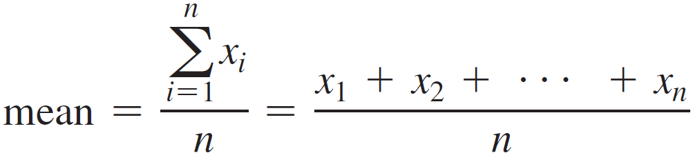

Use the for loop for all of the following problems.

Problem 1

Heads or tails: Write a program that simulates flipping a coin two million times and displays the number of heads and tails.  Also, display the % of the flips as an integer.  This program must use integers only, no doubles or float values.

Output Example:

Flips: 2000
Heads: 805 (40%)
Tails: 1195 (59%)

Make sure the values generated in the code/program are correct.  The output does not have to match the example 100%.

Problem 2

Financial application that computes future tuition: Suppose that the tuition for a university is $10,000 this year and increases 6% every year. In one year, the tuition will be $10,600. Write a program that computes the tuition in Y number of years and the total cost of four years’ worth of tuition after the Yth year.

Inputs:

Initial tuition ($10,000)
Percent yearly increase (6%)
How many years (Y) to start calculating 4 years of tuition?
Output:

Provide good prompts to the user.
Provide good information about the results.
Make sure the values generated in the code/program are correct.  The output does not have to match the example 100%.

Problem 3

Conversion from Cº to Fº and Fº to Cº: Write a program that displays the following
two tables side by side:
Celsius Fahrenheit | Fahrenheit Celsius
0           32.000 | 20          −6.667
2           35.600 | 25          −3.889
...
98         208.400 | 265        129.444
100        212.000 | 270        132.222

Input:

The starting Fahrenheit value.
If this value is not a multiple of 5, then update the number to the closest multiple of 5.  For example: if given 21, start at 20.  if given 24, start at 25.
Output:

The table above with the 51 rows of data.
Formate the table as shown above.
Make sure the values generated in the code/program are correct.  The output does not have to match the example 100%.

Problem 4

Compute mean and standard deviation:  In business applications, you are often asked to compute the mean and standard deviation of data. The mean is simply the average of the numbers. The standard deviation is a statistic that tells you how tightly all the various data are clustered around the mean in a set of data. For example, what is the average age of the students in a class? How close are the ages? If all the students are the same age, the deviation is 0.

Write a program that prompts the user to enter 10 numbers and displays the mean and standard deviations of these numbers using the following formula:

Make sure the values generated in the code/program are correct.  The output does not have to match the example 100%.