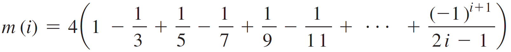

Make sure the values generated in the code/program are correct. The output does not have to match the example 100%. These assignments are all about Methods. Make sure you create methods for all these assignments. No Methods will result in no points.

Problem 1

Math Pentagonal Numbers: A pentagonal number is defined as n(3n-1)/2 for n = 1 , 2 , …, and so on. Therefore, the first few numbers are 1, 5, 12, 22, . . . .

Write a method with the following header that returns a pentagonal number:

public static int getPentagonalNumber(int n)

For example, getPentagonalNumber(1) returns 1 and getPentagonalNumber(2) returns 5.

Write a test program that uses this method to display the first 100 pentagonal numbers with 10 numbers on each line. Use the %7d format to display each number.

Problem 2

Financial Credit Card Number Validation: Credit card numbers follow specific patterns. A credit card number must have between 13 and 16 digits. It must start with

4 for Visa cards
5 for Master cards
37 for American Express cards
6 for Discover cards
In 1954, Hans Luhn of IBM proposed an algorithm for validating credit card numbers. The algorithm is helpful to determine whether a card number is entered correctly or whether a credit card is scanned correctly by a scanner. Credit card numbers are generated following this validity check, commonly known as the Luhn check or the Mod 10 check, which can be described as follows (for illustration, consider the card number 4388576018402626):

Double every second digit from right to left. If doubling a digit results in a two-digit number, add the two digits to get a single-digit number. 4388576018402626
Card Digit	Equation	Result
4	4 * 2 = 8	8
3		
8	8 * 2 = 16
(1 + 6 = 7)	7
8		
5	5 * 2 = 10
(1 + 0 = 1)	1
7		
6	6 * 2 = 12
(1 + 2 = 3)	3
0		
1	1 * 2 = 2	4
8		
4	4 * 2 = 8	8
0		
2	2 * 2 = 4	4
6		
2	2 * 2 = 4	4
6		
Now add all single-digit numbers from Step 1.
4 + 4 + 8 + 2 + 3 + 1 + 7 + 8 = 37

Add all digits in the odd places from right to left in the card number.
6 + 6 + 0 + 8 + 0 + 7 + 8 + 3 = 38

Sum the results from Step 2 and Step 3.
37 + 38 = 75

If the result from Step 4 is divisible by 10, the card number is valid; otherwise, it is invalid. For example, the number 4388576018402626 is invalid, but the number 4388576018410707 is valid.
Write a program that prompts users to enter a credit card number as a long integer. Display whether the number is valid or invalid. Display what brand of credit card it is. Design your program to use the following methods:

/** Return true if the card number is valid */
public static boolean isValid(long number)

/** Get the result from Step 2 */
public static int sumOfDoubleEvenPlace(long number)

/** Return this number if it is a single digit, otherwise,
* return the sum of the two digits */
public static int getDigit(int number)

/** Return sum of odd-place digits in number */
public static int sumOfOddPlace(long number)

/** Return true if the number d is a prefix for number */
public static boolean prefixMatched(long number, int d)

/** Return the number of digits in d */
public static int getSize(long d)

/** Return the first k number of digits from number. If the
;* number of digits in number is less than k, return number. */
public static long getPrefix(long number, int k)

/** Return a string stating the type of card this number
 * belongs to. */ 
public static String getTypeOfCard(long number)

Problem 3

Occurrences of a Specified Character: Write a method that finds the number of occurrences of a specified character in a string using the following header:

public static int count(String str, char a)

For example, count("Welcome", 'e') returns 2. Write a test program that prompts the user to enter a string followed by a character and then displays the number of occurrences of the character in the string.

Problem 4

Estimate Pi: Pi can be computed using the following summation:

Write a method that returns m(i) for a given i and write a test program that displays the following table.  The result values don't have to be formatted to 4 decimal places.  The table should be formatted in the output window.  The table should go up to 2001 for i.

i	m(i)
1	4.0000
101 	3.1515
201 	3.1466
301 	3.1449
401 	3.1441
501 	3.1436
601 	3.1433
701	3.1430
