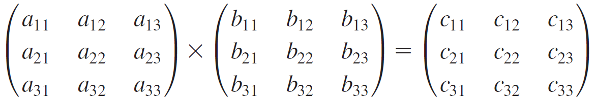

Problem 1

Sum the elements of a row by the row.  Write a method that returns the sum of all the elements in a specified row in a matrix using the following header:

public static double sumRow(double[][] m, int rowIndex)

Write a test program that reads a 3-by-4 matrix and displays the sum of each row.
Here is a sample run:

Output Example:

Enter 12 number values:
1.5 2 3 4 5.5 6 7 8 9.5 1 3 1
Matrix (3x4):
1.5 2 3 4
5.5 6 7 8
9.5 1 3 1
Sum of the elements in row 0 is 10.5
Sum of the elements in row 1 is 26.5
Sum of the elements in row 2 is 14.5

Make sure the values generated in the code/program are correct.  The output does not have to match the example 100%.

Problem 2

Algebra: multiply two matrices.  Write a method to multiply two matrices. The header of the method is:

public static double[][] multiplyMatrix(double[][] a, double[][] b)

To multiply matrix a by matrix b, the number of columns in a must be the same as
the number of rows in b, and the two matrices must-have elements of the same or
compatible types. Let c be the result of the multiplication. Assume the column size
of matrix a is n. Each element cij is ai1 * b1j + ai2 * b2j + ... + ain * bnj.
For example, for two 3 * 3 matrices a and b, c is

where cij = ai1 * b1j + ai2 * b2j + ai3 * b3j.

Write a test program that prompts the user to enter two 3 * 3 matrices and displays their product. Here is a sample run:

Output Example:

Enter matrix1: 1 2 3 4 5 6 7 8 9
Enter matrix2: 0 2 4 1 4.5 2.2 1.1 4.3 5.2
The multiplication of the matrices is
1 2 3   0   2.0 4.0    5.3 23.9 24
4 5 6 * 1   4.5 2.2 = 11.6 56.3 58.2
7 8 9   1.1 4.3 5.2   17.9 88.7 92.4

Make sure the values generated in the code/program are correct.  The output does not have to match the example 100%.

Problem 3

Game: play a tic-tac-toe game.  In a tic-tac-toe game, two players take turns marking an available cell in a 3 * 3 grid with their respective tokens (either X or O). When one player has placed three tokens in a horizontal, vertical, or diagonal row on the grid, the game is over, and that player has won. A draw (no winner) occurs when all the cells on the grid have been filled with tokens, and neither player has achieved a win. Create a program for playing a tic-tac-toe game.

The program prompts two players to enter an X token and an O token alternately. Whenever a token is entered, the program redisplays the board on the console and determines the game's status (win, draw, or continue). Here is a sample run:

Output Example:

-------------
|   |   |   |
-------------
|   |   |   |
-------------
|   |   |   |
-------------
Enter a row (0, 1, or 2) for player X: 1
Enter a column (0, 1, or 2) for player X: 1
-------------
|   |   |   |
-------------
|   | X |   |
-------------
|   |   |   |
-------------
Enter a row (0, 1, or 2) for player O: 1
Enter a column (0, 1, or 2) for player O: 2
-------------
|   |   |   |
-------------
|   | X | O |
-------------
|   |   |   |
-------------

. . .

-------------
| X |   |   |
-------------
| O | X | O |
-------------
|   |   | X |
-------------
X player won

Make sure the values generated in the code/program are correct.  The output does not have to match the example 100%.

Problem 4

Average the major diagonal in a matrix.  Write a method that averages all the numbers in the major diagonal in an n * n matrix of double values using the following header:

public static double averageMajorDiagonal(double[][] m)

Write a test program that reads an integer for the matrix size. Then, it reads in a matrix size2 number of double values to fill the matrix.  Finally, it displays the average of all its elements on the major diagonal. Here is a sample run:

Output Example:

Enter the size of the matrix: 4
Enter number values to fill up the 4−by−4 matrix:
1  2   3  4.0
5  6.5 7  8
9  10  11 12
13 14  15 16
The average of the elements in the major diagonal is 8.625

Make sure the values generated in the code/program are correct.  The output does not have to match the example 100%