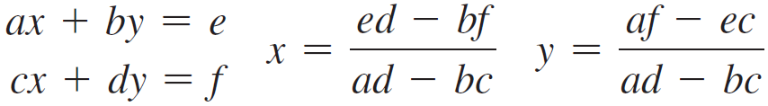

Problem 1

Create and design a class called the Rectangle. Following the example of the Circle class (see GitHub Repository), design a class named Rectangle to represent a rectangle.

The class contains:

Two double data fields that are named width and height. These fields will be used to specify the width and height of the rectangle. The default values are 1 for both width and height.
A no-arg constructor that creates a default rectangle.
A constructor that creates a rectangle with the specified width and height.
A method named getArea() will return the area of this rectangle.
A method named getPerimeter() will return the perimeter.
Draw the UML diagram for the class, then implement the class. Write a test program that creates two Rectangle objects—one with a width of 4 and a height of 40, and the other with a width of 3.5 and a height of 35.9. Display each rectangle's width, height, area, and perimeter in this order.

Problem 2

Use the Date class to help write a program that creates a Date object, sets its elapsed time to 10_000, 100_000, 1_000_000, 10_000_000, 100_000_000, 1_000_000_000, 10_000_000_000, and 100_000_000_000, and displays the date and time using the toString() method, respectively.

Problem 3

Algebra: 2 * 2 linear equations. Design a class named LinearEquation for a 2 * 2 system of linear equations:

The class contains:

Private data fields a, b, c, d, e, and f.
A constructor with the arguments for a, b, c, d, e, and f.
Six getter methods for a, b, c, d, e, and f.
A method named isSolvable() that returns true if ad - bc is not 0.
Methods getX() and getY() that return the solution for the equation.
Draw the UML diagram for the class, and then implement the class. Write a test program that prompts the user to enter a, b, c, d, e, and f and displays the result. If ad - bc is 0, report, "The equation has no solution.” 

Problem 4

Use the Random class to help write a program that creates a Random object with a seed of 1000 and displays the first 50 random integers between 0 and 100 using the nextInt(100) method.